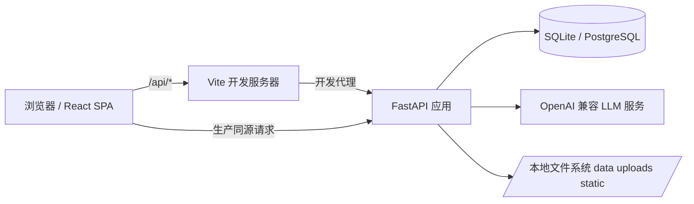
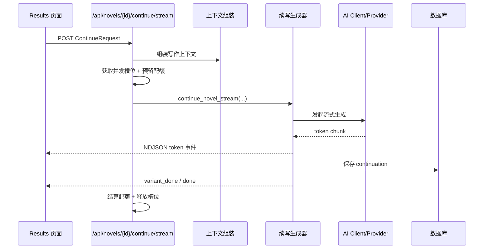
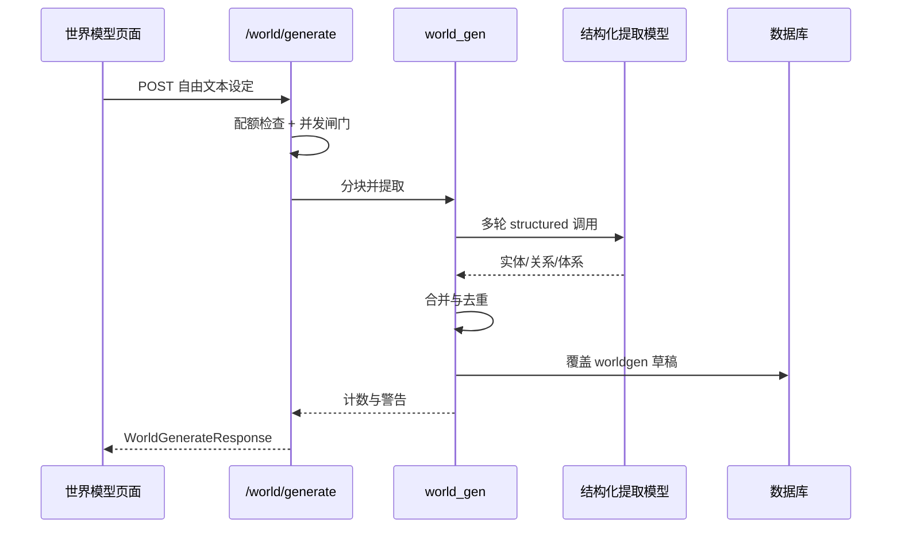
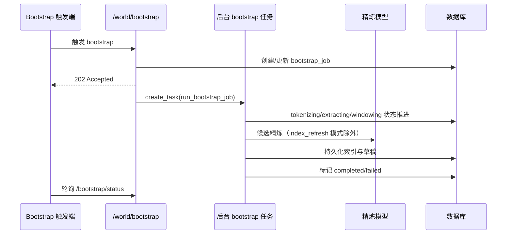

# NovelWriter 项目架构说明

本文档面向开发与维护人员，描述 `novelwriter` 当前版本的整体架构、模块边界、关键数据流与扩展点。

## 1. 项目定位与能力边界

NovelWriter 是一个“小说续写 + 世界模型管理”的全栈系统，核心目标是让续写结果与作品上下文、设定体系保持一致。

主要能力：

- 小说上传与章节管理
- AI 续写（普通接口 + 流式 NDJSON）
- 世界模型管理（实体、属性、关系、体系）
- 从自由文本生成世界模型草稿
- Bootstrap 设定抽取（章节文本 -> 候选词 -> LLM 精炼 -> 草稿入库）
- Lorebook 注入与上下文拼装

技术栈：

- 后端：FastAPI + SQLAlchemy + Alembic
- 前端：React + TypeScript + Vite + React Query
- 数据库：SQLite（selfhost 默认）/ PostgreSQL
- 模型接入：OpenAI 兼容协议（服务端配置 + BYOK 头）

## 2. 运行拓扑

说明：

- 开发环境下，`/api/*` 由 Vite 反向代理到后端。
- 生产容器模式下，前端静态资源由后端同源提供。
- 所有 LLM 请求都由后端发起，前端不直接访问模型服务。

## 3. 后端架构

### 3.1 应用入口与装配

- 入口文件：`app/main.py`
- 生命周期：
  - 启动时重载配置（`.env`）
  - 执行启动安全检查
  - 在允许条件下执行数据库初始化兜底
- 全局能力：
  - 请求日志中间件（生成并透传 `X-Request-ID`）
  - 限流异常处理（slowapi）
  - SPA 静态资源挂载与回退路由（生产）

### 3.2 API 路由层（`app/api/*`）

各路由职责：

- `auth.py`
  - 登录/邀请码注册/会话 cookie
  - 配额查询、偏好保存、反馈提额
  - 管理员反馈导出与漏斗统计
- `novels.py`
  - 小说上传、小说与章节 CRUD
  - 续写接口（非流式 + 流式）
  - 续写结果查询、小说级联删除
- `world.py`
  - 世界模型各组件 CRUD
  - 草稿确认/拒绝
  - worldpack 导入
  - 世界生成、bootstrap 触发与状态查询
- `lorebook.py`
  - lore 条目与关键词管理
  - 匹配与注入调试
- `llm.py`
  - LLM 连通性测试
- `usage.py` / `dashboard.py`
  - 使用统计与聚合读模型

### 3.3 领域核心层（`app/core/*`）

- `ai_client.py`
  - 封装 OpenAI 兼容客户端
  - 支持普通、流式、结构化输出
  - 记录 token 使用量
  - 兼容性重试（如 `stream_options` 不支持、`max_tokens` 上限回退）
- `generator.py`
  - 续写 prompt 组装
  - 世界知识与 lore 注入
  - 续写流事件产出（`start/token/variant_done/done/error`）
- `context_assembly.py`
  - Aho-Corasick 相关实体命中
  - 基于可见性的上下文过滤与拼装
  - 上下文预算裁剪
- `bootstrap.py`
  - 章节分词与候选抽取
  - 窗口索引与共现关系计算
  - LLM 精炼与草稿持久化
- `world_gen.py`
  - 文本设定抽取为世界草稿（分块、合并、去重）
- `auth.py`
  - JWT/cookie 鉴权
  - selfhost 默认用户兜底
  - 配额预留/结算
- `safety_fuses.py`
  - hosted 用户上限熔断
  - hosted AI 预算熔断
- `llm_semaphore.py`
  - 进程内 LLM 并发闸门

### 3.4 数据访问与迁移

- ORM 模型定义：`app/models.py`
- 引擎与会话：`app/database.py`
- 迁移体系：`alembic/versions/*`
- selfhost 数据库引导：`app/selfhost_db_bootstrap.py`
  - 处理“无版本号/半旧库/历史状态”场景
  - 在可判定安全时自动 stamp 或升级

## 4. 前端架构

### 4.1 入口与全局 Provider

- 入口：`web/src/main.tsx`
- 根组件：`web/src/App.tsx`
- 全局 Provider：
  - `QueryClientProvider`（服务端状态缓存）
  - `AuthProvider`（登录态、用户信息、配额刷新）

### 4.2 路由结构

公开页面：

- `/`
- `/terms`
- `/privacy`
- `/copyright`
- `/login`

鉴权页面：

- `/library`
- `/novel/:novelId`
- `/novel/:novelId/chapter/:chapterNum/write`
- `/novel/:novelId/chapter/:chapterNum/results`
- `/world/:novelId`
- `/settings`

### 4.3 前后端交互模式

- API 适配层：`web/src/services/api.ts`
- 关键机制：
  - `credentials: include` 走会话 cookie
  - 错误统一映射为 `ApiError`
  - 对 `503` 按 `Retry-After` 做有限重试
  - 续写相关接口按需注入 `X-LLM-*`（BYOK）
- 流式续写：
  - 前端按 NDJSON 增量解析
  - 结果页实时消费 token 并更新 UI

## 5. 逻辑数据模型

核心聚合：

- 小说内容域
  - `novels`, `chapters`, `outlines`, `continuations`
- 世界模型域
  - `world_entities`, `world_entity_attributes`, `world_relationships`, `world_systems`
- Lore 域
  - `lore_entries`, `lore_keys`
- 用户与配额域
  - `users`, `quota_reservations`
- 统计与计费域
  - `token_usage`, `user_events`
- 任务编排域
  - `bootstrap_jobs`
- 探索域
  - `explorations`, `exploration_chapters`

关键字段语义：

- `origin`：区分 `manual/bootstrap/worldgen/worldpack`
- `status`：区分 `draft/confirmed`
- `world_relationships.label_canonical`：关系去重与索引稳定化
- `novels.window_index`：bootstrap 窗口索引持久化载体

## 6. 关键业务流程

### 6.1 续写流式流程

语义要点：

- `variant=0` 逐 token 流出。
- 其余 variant 走非流式生成，完成后回传 `variant_done`。
- 生成阶段的业务异常优先转成流内 `error` 事件，尽量避免直接断 HTTP。

### 6.2 世界生成流程

### 6.3 Bootstrap 流程

## 7. 横切能力

### 7.1 鉴权模式

- selfhost：
  - 默认用户自动创建与回退，便于本地单用户运行
- hosted：
  - 邀请码注册
  - 受保护资源按用户维度隔离

### 7.2 配额与成本控制

- hosted 模式采用“预留 -> 按实际成功结算 -> 失败返还”策略。
- token 使用量持久化，支持预算控制与分析。
- 安全熔断可按预算阈值停止 AI 功能。

### 7.3 并发与背压

- LLM 调用通过信号量限制并发。
- 满载时返回 `503 + Retry-After`，前端按策略重试。
- 关键写路径（如 world generate / bootstrap）按 novel 粒度加锁防并发冲突。

### 7.4 可观测性

- 请求级日志附带 request_id。
- 续写链路关键日志统一输出 `request_id/novel_id/user_id/variant/attempt`（logger `extra`）。
- 关键行为写入 `user_events`，支持漏斗分析与运营复盘。
- 续写新增事件：`continue_strict_retry`、`continue_strict_fail`、`continue_lore_enabled`。

## 8. 部署与发布架构

### 8.1 Docker（默认 selfhost）

- 多阶段构建：
  - Stage 1：构建前端静态资源
  - Stage 2：运行 FastAPI 并提供静态文件
- `docker-compose.yml` 默认：
  - `127.0.0.1:8000:8000`
  - 挂载 `/data` 持久化
  - `DEPLOY_MODE=selfhost`

### 8.2 数据库迁移策略

- Alembic 是主迁移路径。
- selfhost 启动引导脚本会在安全条件下自动处理 stamp/upgrade，降低本地运维成本。

## 9. 目录与职责映射

- `app/api/`：传输层与接口编排
- `app/core/`：领域逻辑与 AI 编排
- `app/models.py`：数据库实体模型
- `app/schemas.py`：请求响应契约
- `app/database.py`：引擎与会话管理
- `web/src/pages/`：路由级页面
- `web/src/components/`：可复用 UI 组件
- `web/src/services/api.ts`：前端 API 适配层
- `alembic/`：迁移环境与版本历史
- `tests/`：后端测试
- `web/e2e/`：端到端测试

## 10. 可扩展点

推荐扩展切入点：

- 新模型服务/供应商兼容：`app/core/ai_client.py`
- 新的世界抽取策略：`app/core/world_gen.py`
- 新事件分析维度：`app/core/events.py` + `auth.py` 管理接口
- 后台任务外部化：将当前进程内 `create_task` 替换为独立队列/worker（保留 `bootstrap_jobs` 合约）

## 11. 当前架构权衡与限制

- LLM 并发闸门是进程内实现，横向扩展需引入分布式协调。
- Bootstrap 任务与应用进程同生命周期，重启后依赖“陈旧任务恢复”机制。
- SQLite 适合 selfhost，重并发 hosted 场景建议 PostgreSQL。
- 流式接口连接生命周期较长，前置网关需正确配置超时策略。
